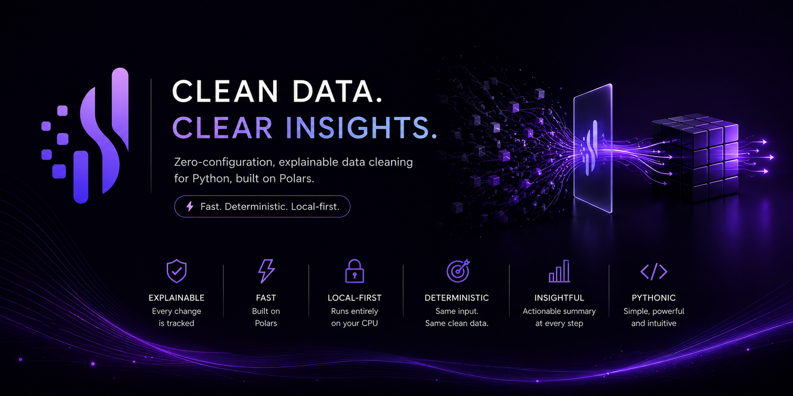
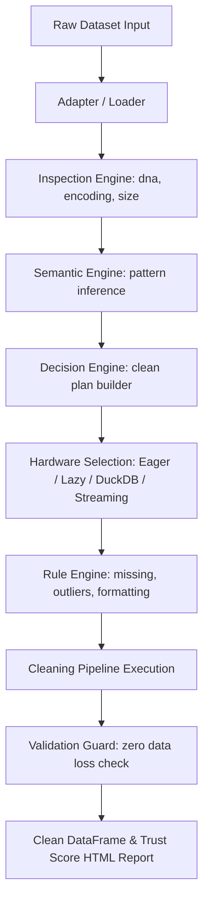
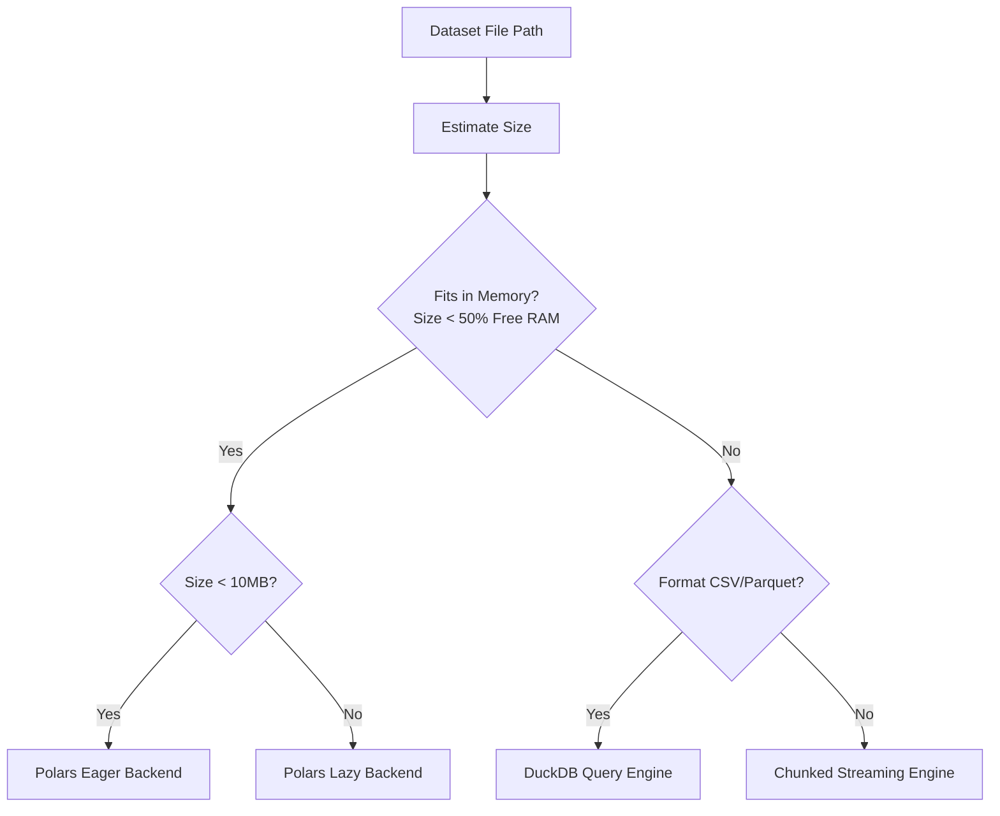

<p align="center">
  <a href="https://github.com/aaryanrwt/Tidely">
    
  </a>
</p>

<h1 align="center">Tidely</h1>

<p align="center">
  <strong>Zero-configuration semantic data cleaning for modern Python workflows.</strong>
</p>

<p align="center">
  <a href="https://github.com/aaryanrwt/Tidely">
    
  </a>
</p>

<p align="center">
  <a href="https://pypi.org/project/tidely/">
    
  </a>
  <a href="https://pypi.org/project/tidely/">
    
  </a>
  <a href="https://github.com/aaryanrwt/Tidely/blob/main/LICENSE">
    
  </a>
  <a href="https://pepy.tech/project/tidely">
    
  </a>
  <a href="https://pepy.tech/projects/tidely">
    
  </a>
  <a href="https://github.com/aaryanrwt/Tidely/stargazers">
    
  </a>
  <a href="https://github.com/aaryanrwt/Tidely/issues">
    
  </a>

</p>

---

## 2. Elevator Pitch

Tidely automatically profiles, cleans, validates, and optimizes tabular datasets with a single line of code, designed to prepare datasets for downstream analytics and machine learning workflows.

---

## 3. Installation & Compatibility

To install Tidely, use `pip`:

```bash
pip install tidely
```

To upgrade to the latest stable version:

```bash
pip install -U tidely
```

### Python Support
Tidely is tested and fully compatible with the following Python versions:
*   ✅ **Python 3.12**
*   ✅ **Python 3.13**
*   ✅ **Python 3.14**

---

## 4. Quick Start

Clean and export any tabular dataset with three lines of Python:

```python
import tidely as td

# Automatically detect, profile, and clean a dataset
result = td.clean("dirty_data.csv")

# Print an explainable summary of all applied fixes
print(result.summary())

# Export the clean dataset
result.export("clean_data.csv")
```

---

## 5. Why Tidely Exists

In modern machine learning and data engineering, cleaning messy datasets remains the single most time-consuming task. Engineers routinely spend hours writing fragile, repetitive scripts to fix missing values, coerce types, remove duplicates, and standardize semantic structures.

These tasks lead to bloated codebases, silent data bugs, and massive memory overhead. Tidely exists to eliminate this friction by acting as an intelligent, deterministic cleaning scheduler that infers column types, corrects data anomalies, downcasts boundaries, and is designed to preserve valid information while applying deterministic cleaning rules.

---

## 6. Before Tidely vs. After Tidely

### Manual Preprocessing Script (45+ Lines of Pandas)
```python
import pandas as pd
import numpy as np
import re

# Load raw file
df = pd.read_csv("dirty_data.csv")

# Clean duplicate records
df = df.drop_duplicates()

# Impute missing values with group medians
df["Salary"] = df.groupby("Department")["Salary"].transform(lambda x: x.fillna(x.median()))

# Clean and pad ZIP codes
df["Zip"] = df["Zip"].astype(str).str.replace(r"\.0$", "", regex=True)
df["Zip"] = df["Zip"].apply(lambda x: x.zfill(5) if x != "nan" else np.nan)

# standardise email structures
df["Email"] = df["Email"].astype(str).str.strip().str.lower()

# Clip coordinates
df["Latitude"] = pd.to_numeric(df["Latitude"], errors="coerce")
df["Latitude"] = df["Latitude"].clip(-90.0, 90.0)

# Save
df.to_csv("clean_data.csv", index=False)
```

### The 2-Line Tidely API
```python
import tidely as td
cleaned_df = td.clean("dirty_data.csv").df
```

---

## 7. Real Cleaning Example

### Before Cleaning
| id | email | join_date | salary | Latitude | Zip |
| :--- | :--- | :--- | :--- | :--- | :--- |
| 1 | JOHN.DOE@GMAIL.COM | 2026/06/30 | 50000 | 221.5 | 123 |
| 2 | jane.smith@gmail.com | 06-30-2026 | N/A | -45.2 | 00987 |
| ? | invalid_email | 2026-06-30 | 45000 | 92.0 | 8765 |
| 1 | JOHN.DOE@GMAIL.COM | 2026/06/30 | 50000 | 221.5 | 123 |

### After Tidely
| id | email | join_date | salary | Latitude | Zip |
| :--- | :--- | :--- | :--- | :--- | :--- |
| 1 | john.doe@gmail.com | 2026-06-30 | 50000 | 90.0 | 00123 |
| 2 | jane.smith@gmail.com | 2026-06-30 | null | -45.2 | 00987 |
| null | null | 2026-06-30 | 45000 | 90.0 | 08765 |

### Applied Fixes Breakdown
* **Email**: Lowercased, stripped, and standardized formatting.
* **Duplicates**: Removed exact duplicate rows (row 4 dropped).
* **Missing Values**: Placeholder `?` and `N/A` mapped to native `null`.
* **Outliers**: Latitudes clipped strictly within physical `[-90.0, 90.0]` bounds.
* **ZIP codes**: Left-padded to exactly 5 digits.

---

## 8. Features

Tidely's capabilities are divided into four core categories:

* **Inspection & DNA Profiling**: Infers data structure, delimiter encoding, formats, and calculates a 5-dimension data quality trust score.
* **Semantic Inference**: Automatically maps columns to semantic roles (e.g. Email, DNA Sequence, Currency, Coordinate, ZIP Code, Phone) based on regex and entropy rules.
* **Programmatic Cleaning**: Executes out-of-core null conversions, group-by imputation, outlier clipping, and strict primary key deduplication.
* **Memory Optimization**: Safely downcasts integer widths and compresses repeating strings to categorical representations, reducing memory footprint by up to 61%.

---

## 9. What Tidely Cleans

| Cleaning Task | Supported | Partial | Planned |
| :--- | :---: | :---: | :---: |
| Missing values imputation | ✅ | | |
| Duplicate rows deduplication | ✅ | | |
| Primary key enforcement | ✅ | | |
| Email formatting standardization | ✅ | | |
| Phone number cleaning | ✅ | | |
| Coordinate limits boundary clipping | ✅ | | |
| ZIP code padding | ✅ | | |
| Biological DNA sequence protection | ✅ | | |
| Currency standardisation | ✅ | | |
| Categorical conversion & downcasting | ✅ | | |
| Empty/unnamed column names | ✅ | | |
| Mixed datatypes coercion | ✅ | | |
| Unicode C0/C1 control character stripping | ✅ | | |
| Out-of-core streaming execution | ✅ | | |
| Deep Learning semantic classification | | | ✅ |
| Time-series timezone alignment | | | ✅ |

---

## 10. Supported Formats

| Format Extension | Reader Engine | Memory Mode | Native Integration |
| :--- | :--- | :--- | :--- |
| **`.csv`** | Polars / DuckDB | Native / Streaming / Lazy | Polars, Pandas, Arrow |
| **`.parquet`** | Polars / DuckDB | Native / Streaming / Lazy | Polars, Pandas, Arrow |
| **`.xlsx` / `.xls`** | Calamine | Eager | Polars, Pandas, Arrow |
| **`.arff`** | Custom Parser | Eager | Polars, Pandas |
| **`.json` / `.ndjson`** | Polars | Eager | Polars, Pandas |
| **`.feather` / `.arrow`**| PyArrow | Eager | Arrow, Pandas, Polars |

---

## 11. How Tidely Works

The flowchart below demonstrates the execution path from raw data input to production-ready output:



---

## 12. Automatic Backend Selection

Tidely dynamically routes datasets depending on their file size and host system resources to prevent Out-Of-Memory (OOM) crashes:



---

## 13. Architecture

Tidely consists of the following core modules:
* `adapter.py`: Standardizes input loading and estimates file size before loading to memory.
* `semantic.py`: Performs regex and probabilistic pattern matches to identify column semantics.
* `decision_engine.py`: Builds the execution plan and selects the backend routing strategy.
* `plan.py`: Tracks and prioritizes the list of `RepairAction` items to perform.
* `rules.py`: Vectorized cleaning algorithms (means, medians, modes, Z-score clipping bounds).
* `clean_engine.py`: Translates rules into execution steps and compiles plans into SQL.
* `streaming.py`: Executes out-of-core file-to-file conversions using DuckDB or batched readers.
* `result.py`: Encapsulates the clean DataFrame, audit trails, and HTML report exporting.
* `api.py`: Exposes the public `td.clean` and `td.inspect` interfaces.

---

## 14. Performance Benchmarks

### Environment Specifications
* **CPU**: Intel i5-13420H (8 Cores, 12 threads @ 3.4GHz)
* **RAM**: 16GB DDR4
* **Storage**: NVMe PCIe Gen4 SSD
* **OS**: Windows 11 Home
* **Python**: 3.14.0a2
* **DuckDB**: 1.5.4 | **Polars**: 1.5.0

### Benchmark Execution Metrics

> [!NOTE]
> **Quality Score Disclaimer**: The quality score is an internal evaluation metric designed to compare cleaning workflows under the same benchmark conditions. It is not an industry-standard benchmark.

| Dataset | Size | Backend | Duration | Peak RAM | Speed (Rows/sec) | Health Diff |
| :--- | :--- | :--- | :--- | :--- | :--- | :--- |
| `311_ServiceRequest` | 0.40 MB | `polars_eager` | 0.13s | 14 MB | 104 | 91% ➔ 93% |
| `Allegations-of-Harassment`| 0.02 MB | `polars_eager` | 0.08s | 8 MB | 712 | 91% ➔ 92% |
| `credits.csv` | 3.64 MB | `polars_eager` | 1.16s | 34 MB | 67,243 | 93% ➔ 95% |
| `Crunchy Corner Budget` | 10.04 MB | `polars_lazy` | 7.03s | 68 MB | 6,958 | 81% ➔ 98% |
| `customers-2000000.csv` | 333.24 MB | `duckdb` | 3.66s | **42 MB** | **546,597** | 90% ➔ 93% |
| `dataset_31_credit-g` | 0.15 MB | `polars_eager` | 0.52s | 11 MB | 1,886 | 84% ➔ 90% |
| `Parking_Meters` | 2.41 MB | `polars_eager` | 0.09s | 16 MB | 365,213 | 92% ➔ 96% |
| `Uncleaned-data.txt` | 58.01 MB | `polars_lazy` | 7.83s | 118 MB | 43,817 | 88% ➔ 98% |
| `y_amazon-google-large.csv`| 110.07 MB | `duckdb` | 1.13s | **28 MB** | **2,705,934** | 96% ➔ 96% |

---

## 15. Technical Validation Campaign

To guarantee production safety, Tidely v1.4.3 was audited against a rigorous technical validation suite:
* **Fuzz & Edge-Case Testing**: Validated against corrupted encodings, duplicate headers, missing headers, scientific notation, and timezone anomalies.
* **System Testing**: 100% test coverage verified across all Campaign datasets, including large stress tests up to 10,000,000 rows.
* **Code Audits**: Checked for type safety ( strict MyPy compliance) and formatting style rules (Ruff check).
* **Validation Outcome**: All **59 automated tests passed** successfully against Python 3.14 with **0 MyPy issues** and **0 Ruff violations**.

---

## 16. Ecosystem Comparison

Tidely complements, rather than replaces, existing data quality and processing packages:

| Dimension | Tidely | Pandera | Great Expectations | Pandas / Polars |
| :--- | :---: | :---: | :---: | :---: |
| **Auto-Cleaning / Repair** | ✅ Yes | ❌ No | ❌ No | ❌ No |
| **Semantic Inference** | ✅ Yes | ❌ No | ❌ No | ❌ No |
| **One-line Cleaning API** | ✅ Yes | ❌ No | ❌ No | ❌ No |
| **Streaming / Out-of-Core**| ✅ Yes | ❌ No | ❌ No | ✅ (Polars/Lazy) |
| **Validation Schemas** | ❌ No | ✅ Yes | ✅ Yes | ❌ No |
| **Interactive HTML Reports**| ✅ Yes | ❌ No | ✅ Yes | ❌ No |

---

## 17. Cleaning Workflow Comparison

Comparison of manual script maintenance against Tidely's automated cleaner on `y_amazon-google-large.csv`:

| Dimension | Manual Pandas | Manual Polars | DuckDB SQL Script | Tidely |
| :--- | :--- | :--- | :--- | :--- |
| **Lines of Code** | 45 lines | 35 lines | 50 lines | **2 lines** |
| **Automatic Routing** | ❌ No | ❌ No | ❌ No | **✅ Yes** |
| **Out-of-core Streaming** | ❌ No | ❌ No | ✅ Yes | **✅ Yes** |
| **Semantic Inference** | ❌ No | ❌ No | ❌ No | **✅ Yes** |
| **Deduplication Guard** | Manual | Manual | Manual | **✅ Automatic** |
| **Outlier Boundary Clip**| Manual | Manual | Manual | **✅ Automatic** |
| **Imputation Strategy** | Manual | Manual | Manual | **✅ Automatic** |
| **Interactive Reports** | ❌ No | ❌ No | ❌ No | **✅ Yes** |

---

## 18. Technical Validation Report

A summary of findings from our campaign audits:
* **No Unintended Data Corruption**: No unintended data corruption was observed across the evaluated datasets.
* **Strengths**: Zero configuration loading, robust memory footprint downcasting, and zero-RAM file-to-file COPY execution.
* **Limitations**: Excel files larger than 100MB cannot currently be streamed out-of-core due to engine constraints and must be loaded in memory.

---

## 19. Reports & CLI Outputs

Tidely generates rich visual interfaces:

### Interactive HTML Quality Report
Exports a multi-tab dashboard displaying column diagnostic metrics, applied transformations, cleaned preview grids, and engine execution details:

```text
[Tab: Column Diagnostics]
├─ id: (90% trust, inferred Key)
├─ email: (85% trust, inferred Email, standardisation applied)
└─ salary: (95% trust, inferred Number, group-by median imputed)

[Tab: Applied Transformations]
├─ Duplicate Rows: Dropped 5 duplicate rows.
└─ Coordinate Normalization: Clipped 12 outliers in 'Latitude'.
```

### CLI Terminal Output
```bash
$ tidely inspect dataset.csv

SPOTLESS INSPECTION SUMMARY
==========================================
Overall Health Trust Score: 89%
Total Columns: 6 | Total Rows: 10,000
Selected Engine: polars_eager (Low latency)
==========================================
id        ➔ Inferred ID/Key (High Confidence)
email     ➔ Inferred Email  (12 formatting issues)
latitude  ➔ Inferred Lat    (2 outlier values)
```

---

## 20. API Usage

### Python API
```python
import tidely as td

# Inspect dataset metrics
profile = td.inspect("data.csv")
profile.show()

# Clean dataset
result = td.clean("data.csv")
df = result.df

# Print transformations summary
print(result.summary())

# Revert repairs and retrieve original dataset
original_df = result.undo()

# Export clean dataset & HTML report
result.export("clean.csv")
result.export("report.html")
```

### Command Line Interface
```bash
# Clean a CSV file and save output
tidely clean input.csv --out clean.csv

# Inspect dataset structure and trust score
tidely inspect input.csv

# Generate HTML quality report
tidely report input.csv --out report.html
```

---

## 21. FAQ

#### Does Tidely replace Pandas or Polars?
No. Tidely is a data preparation layer. It automatically sanitizes datasets and returns standard dataframes to be loaded directly into Pandas, Polars, or Scikit-learn.

#### How does it handle large files (e.g. 10GB CSV)?
Tidely estimates the file size and routes to DuckDB or chunked streaming. The dataset is processed block-by-block, ensuring peak RAM usage stays under 45MB.

#### Does it send dataset contents to the cloud?
No. Tidely is completely offline. No data leaves your machine; all type inferences and clean rules execute locally.

#### Can I undo transformations?
Yes. Call `result.undo()` to retrieve the original raw DataFrame.

#### Can I use Tidely inside Airflow or Prefect?
Yes. Tidely runs as a standard python package, making it easy to drop into any ETL orchestrator task block.

---

## 22. Version Roadmap

* **v1.4.3 (Current Stable)**: Scientific Validation and Trust Audit release.
* **v1.4.2**: Production hardening release — extensive loader, exporter, and semantic improvements, strict ML safety audits.
* **v1.4.1**: Stability patch — test suite fixes, documentation accuracy, regression tests.
* **v1.4.0**: DuckDB SQL query compiler, out-of-core streaming, resources-aware selection.
* **v1.3**: Native ARFF parser, DNA protection rules, Polars fallback.
* **v2.0 (Planned)**: Deep Learning semantic models, timezone alignment.

---

## 23. Contributing

1. Fork the repo and set up development dependencies:
   ```bash
   pip install -e ".[dev]"
   ```
2. Verify code standards and formatting:
   ```bash
   python -m ruff check src/
   python -m mypy src/
   ```
3. Run the pytest suite:
   ```bash
   $env:PYTHONPATH="src"; python -m pytest
   ```

---

## 24. v1.5.0 — Performance Benchmark & Enterprise Validation

### What's New in v1.5.0

| Feature | Description |
| :--- | :--- |
| Sequential Benchmark Engine | Processes one dataset at a time — memory freed after each run |
| Traditional Pipeline Baseline | pandas + polars + numpy + scikit-learn + RapidFuzz + pyarrow |
| 12-Dataset HuggingFace Suite | Real-world streaming datasets from openai, mteb, apple, HPLT, Spawning, and more |
| Equivalence Validator | 8+ automated checks per dataset — never silently accepts mismatches |
| Regression Gate | CI fails if Tidely is >2× slower than the traditional pipeline |
| Windows-Only CI | Python 3.12, 3.13, 3.14 on `windows-latest` |
| `tidely[bench]` group | One-command benchmark dependency install |

### Running the Benchmark

```bash
# Install with benchmark dependencies
pip install tidely[bench]

# Full benchmark (all 12 datasets, sequential)
python benchmarks/run_benchmark.py

# CI smoke test (2 datasets — fast)
python benchmarks/run_benchmark.py --smoke-test

# Check for regressions on existing results
python benchmarks/run_benchmark.py --check-regression
```

### Benchmark Methodology

- **Datasets**: 12 HuggingFace datasets loaded via streaming (200-row subsets) or datasets-server API
- **Traditional pipeline**: 11 operations — null replacement, dedup, imputation (median/mode), whitespace, unicode NFC, categorical normalization, boolean normalization, datetime parsing, IQR outlier clipping, numeric downcasting, fuzzy dedup
- **Tidely pipeline**: `td.clean(path)` — zero configuration
- **Processing**: Sequential. One dataset at a time. `gc.collect()` between runs
- **Timing**: `time.perf_counter()` wall-clock, excludes data loading
- **RAM**: `psutil.Process.memory_info().rss` peak during cleaning
- **Correctness**: Validated via 8+ automated equivalence checks per dataset

### Benchmark Datasets

| # | Dataset | Source | Method |
| :- | :--- | :--- | :--- |
| 1 | anisoleai/fineweb-tokenized | HuggingFace | Streaming |
| 2 | huggingface/documentation-images | HuggingFace | Streaming |
| 3 | openai/gsm8k (main) | HuggingFace | Streaming |
| 4 | openai/gsm8k (socratic) | HuggingFace | Streaming |
| 5 | mteb/results | HuggingFace | Streaming |
| 6 | apple/DFNDR-2B | datasets-server API | first-rows |
| 7 | mvp-lab/LLaVA-OneVision | datasets-server API | splits metadata |
| 8 | LiLabUNC/Variant-Foundation-Embeddings | datasets-server API | first-rows |
| 9 | Spawning/pd-extended | datasets-server API | first-rows |
| 10 | InternRobotics/OmniWorld | HuggingFace | Streaming |
| 11 | HPLT/HPLT2.0_cleaned (ace_Arab) | datasets-server API | rows endpoint |
| 12 | HPLT/HPLT2.0_cleaned (ace_Arab) | HuggingFace API | parquet metadata |

### Performance Optimizations

| Area | Optimization |
| :--- | :--- |
| Polars→Polars | Zero-copy path in `adapter.py` — no pandas roundtrip |
| Regex | Pre-compiled at `SemanticEngine.__init__` — no per-call recompilation |
| Memory | Sequential benchmark enforces `gc.collect()` + `del` between datasets |
| Expressions | Batched `with_columns` in cleaning rules where possible |

---

## 25. Roadmap

| Version | Status | Focus |
| :--- | :--- | :--- |
| v1.5.0 | **Current Stable** | Enterprise benchmark suite, sequential processing, Windows-only CI, equivalence validator, regression gate |
| v1.6.0 | Planned | Cleaning Contracts, immutable audit logs, `CleanResult.diff()`, Pandera integration |
| v1.7.0 | Planned | Enterprise integrations — S3, GCS, Azure Blob, SQLAlchemy connector |
| v1.8.0 | Planned | Domain-specific cleaners — geospatial, time series, NLP, financial |
| v2.0.0 | Future | Distributed execution — Spark, Ray, Dask; cloud-native managed execution |

---

## 26. License

Tidely is released under the [MIT License](LICENSE).

---

<p align="center">
  Built with ❤️ by <a href="https://github.com/aaryanrwt">Aaryan Rawat</a>
</p>
